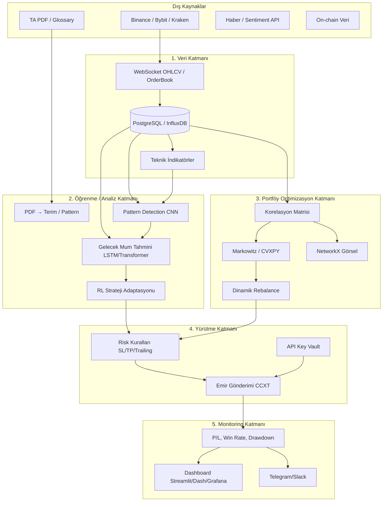

# Zenithai – Kaldıraçlı Otomatik Trading Bot: Sistem Mimarisi

Bu doküman, kripto piyasalarında (Binance, Bybit, BIST vb.) kaldıraçlı, öğrenen ve kendini optimize eden al-sat sisteminin **hedef mimarisini** tanımlar. Mevcut Zenithai (Next.js + FastAPI + PostgreSQL + kağıt emir + piyasalar) bu mimarinin **Veri + Yürütme + Basit Monitoring** katmanlarının ilk aşamasıdır; diğer katmanlar aşamalı eklenecektir.

---

## 1. Akıl Hocası Değerlendirmesi: Bu Fikir Uygun mu?

**Kısa cevap: Evet, uygun — ama tek seferde değil, aşamalı.**

- **Şu ana kadar yaptıklarımız** tam da bu vizyonun temelidir: kullanıcı, auth, piyasalar (ccxt), kağıt emir (market/limit/stop), pozisyon, strateji/backtest/ML iskeleti. Bunlar **Yürütme Katmanı** ve **Veri Katmanı**nın ilk hali.
- **Verdiğin gereksinim listesi** tek projede çok büyük: ML (CNN-LSTM, Transformer, RL), PDF’den terim çıkarma, korelasyon portföyü, hayali mumlar, 24/7 düşük latency, çok borsa… Hepsi **hedef**, ama hepsini aynı anda yapmak hem kaynak hem risk açısından gerçekçi değil.
- **Öneri:** Aşağıdaki mimariyi **hedef mimari** olarak kabul et; uygulamayı **fazlara** böl (Faz 1 → 2 → 3 → 4). Her fazda çalışan, test edilebilir bir sistem olsun; sonra sıradaki katmanı ekle.

Bu dokümanda: (1) hedef mimari diyagramı, (2) ana Python modülleri, (3) kritik parçalar için örnek kodlar, (4) geliştirme/test sırası, (5) riskler ve önlemler toplanmıştır.

---

## 2. Yüksek Seviyeli Mimari

### 2.1 Katmanlar ve Veri Akışı (Mermaid)



### 2.2 Mevcut Zenithai’nin Bu Mimariye Yeri

| Katman            | Hedef bileşenler                          | Zenithai’de şu an                                      |
|-------------------|--------------------------------------------|--------------------------------------------------------|
| Veri              | WebSocket, OHLCV, order book, InfluxDB      | REST (ccxt) OHLCV, ticker, order book, PostgreSQL      |
| Öğrenme/Analiz    | PDF terim, candle pattern, LSTM, RL        | Backtest + ML iskelet (trainer), pattern yok           |
| Portföy           | Korelasyon, Markowitz, rebalance           | Yok                                                    |
| Yürütme           | Risk kuralları, CCXT, vault                 | Kağıt emir (market/limit/stop), gerçek emir yok         |
| Monitoring        | Dashboard, alert, P/L                       | Next.js Piyasalar/Emirler, temel UI                   |

Yani: **Veri + Yürütme (kağıt) + basit Monitoring** var; **Öğrenme** ve **Portföy** katmanları eklenecek.

---

## 3. Ana Python Modülleri (Hedef Yapı)

Aşağıdaki modül listesi, hedef sisteme göredir. Mevcut `backend/app/services/` buna göre genişletilir.

| Modül (paket) | Açıklama |
|----------------|----------|
| `app.services.market_data` | REST + WebSocket ile OHLCV, order book, ticker; ccxt + (opsiyonel) InfluxDB yazma. *Mevcut.* |
| `app.services.indicators` | TA-Lib / pandas ile RSI, MACD, BB, ATR vb. Teknik indikatör hesaplama. |
| `app.services.pdf_ta` | PyPDF2 + spaCy/NLTK ile PDF’den teknik terim/glossary çıkarma, sözlük oluşturma. |
| `app.services.patterns` | Mum pattern tespiti (Hammer, Engulfing, Doji, H&S); kural tabanlı + (ileride) CNN. |
| `app.services.forecast` | LSTM/Prophet/Transformer ile gelecek N mum (OHLC) tahmini; hayali mum çıktısı. |
| `app.services.portfolio` | Rolling korelasyon matrisi, Markowitz (cvxpy), rebalance kuralları, networkx grafik verisi. |
| `app.services.strategy_engine` | Sinyal üretimi, RL tabanlı ağırlık/parametre güncelleme. *Mevcut iskelet.* |
| `app.services.execution` | Gerçek/kağıt emir, SL/TP/trailing, slippage, limit order. *Mevcut kağıt.* |
| `app.services.risk` | Pozisyon başı risk %, liquidation risk, VaR, Kelly. *Mevcut iskelet.* |
| `app.services.monitoring` | Metrik toplama (P/L, win rate, drawdown), Telegram/Slack alert, (opsiyonel) Grafana. |

---

## 4. Kritik Parçalar İçin Örnek Kodlar

### 4.1 PDF’den Teknik Terim Çıkarma

```python
# app/services/pdf_ta/extractor.py (hedef modül)
import re
from pathlib import Path
from typing import Iterator

try:
    import PyPDF2
except ImportError:
    PyPDF2 = None  # pip install PyPDF2


def extract_text_from_pdf(pdf_path: str | Path) -> str:
    if PyPDF2 is None:
        raise ImportError("PyPDF2 required: pip install PyPDF2")
    text = ""
    with open(pdf_path, "rb") as f:
        reader = PyPDF2.PdfReader(f)
        for page in reader.pages:
            text += page.extract_text() or ""
    return text


def extract_ta_terms(
    text: str,
    pattern: str = r"(?i)\b((?:bullish|bearish|support|resistance|rsi|macd|engulfing|doji|hammer|head\s*and\s*shoulders)[\w\s\-]*)\b",
) -> list[str]:
    """Basit regex ile teknik analiz terimlerini çıkarır. İleride spaCy NER kullanılabilir."""
    terms = re.findall(pattern, text, re.IGNORECASE)
    return list(dict.fromkeys(t.strip() for t in terms if len(t.strip()) > 2))


def terms_from_pdf_path(pdf_path: str | Path) -> list[str]:
    text = extract_text_from_pdf(pdf_path)
    return extract_ta_terms(text)
```

### 4.2 Candle Pattern: Hammer Tespiti

```python
# app/services/patterns/candle_detector.py (hedef modül)
import pandas as pd
from typing import Optional


def is_hammer(row: pd.Series, body_ratio: float = 0.4, lower_wick_ratio: float = 2.0) -> bool:
    """
    Hammer: küçük gövde (üstte), uzun alt gölge, üst gölge yok/minimal.
    row: OHLC (open, high, low, close).
    """
    o, h, l, c = row["open"], row["high"], row["low"], row["close"]
    body = abs(c - o)
    full = h - l
    if full <= 0:
        return False
    lower_wick = min(o, c) - l
    upper_wick = h - max(o, c)
    # Gövde küçük, alt gölge uzun, üst gölge kısa
    return (
        body / full <= body_ratio
        and lower_wick / (body + 1e-8) >= lower_wick_ratio
        and upper_wick <= body * 0.5
    )


def detect_hammer(df: pd.DataFrame) -> pd.Series:
    """DataFrame her satırı için Hammer olup olmadığını döner."""
    return df.apply(is_hammer, axis=1)
```

### 4.3 Korelasyon Matrisi ve Portföy Optimizasyonu

```python
# app/services/portfolio/correlation.py (hedef modül)
import numpy as np
import pandas as pd
from typing import Optional

# pip install cvxpy
try:
    import cvxpy as cp
except ImportError:
    cp = None


def rolling_correlation_matrix(
    returns: pd.DataFrame, window: int = 30
) -> pd.DataFrame:
    """Rolling pencerede pair'lerin getiri korelasyon matrisi."""
    return returns.rolling(window).corr().dropna(how="all")


def markowitz_weights(
    returns: pd.DataFrame,
    target_return: Optional[float] = None,
    risk_free: float = 0.0,
) -> np.ndarray:
    """Markowitz ortalama-varyans ile ağırlık vektörü. cvxpy gerekir."""
    if cp is None:
        raise ImportError("cvxpy required: pip install cvxpy")
    mu = returns.mean().values
    cov = returns.cov().values
    n = len(mu)
    w = cp.Variable(n)
    port_return = mu @ w
    port_vol = cp.quad_form(w, cov)
    if target_return is not None:
        prob = cp.Problem(cp.Minimize(port_vol), [cp.sum(w) == 1, w >= 0, port_return >= target_return])
    else:
        # Maksimum Sharpe (basit: risk-free=0)
        prob = cp.Problem(cp.Maximize(port_return / cp.sqrt(port_vol)), [cp.sum(w) == 1, w >= 0])
    prob.solve()
    return w.value
```

### 4.4 Gelecek Mum Tahmini ve Hayali Mum Görselleştirme

```python
# app/services/forecast/next_candles.py (hedef modül)
import numpy as np
import pandas as pd
from typing import Any

# Örnek: basit LSTM placeholder. Gerçekte TensorFlow/PyTorch kullanılır.
# from tensorflow.keras.models import load_model  # veya torch


def predict_next_candles(
    ohlcv: pd.DataFrame,
    n_future: int = 5,
    model: Any = None,
) -> np.ndarray:
    """
    Gelecek n_future mum OHLC tahmini.
    model None ise basit persistence (son mum) döner; entegrasyon için placeholder.
    """
    if model is None:
        last = ohlcv.iloc[-1][["open", "high", "low", "close"]].values
        return np.tile(last, (n_future, 1))  # placeholder
    # Gerçek implementasyonda: model.predict(...) -> (n_future, 4)
    return np.tile(ohlcv.iloc[-1][["open", "high", "low", "close"]].values, (n_future, 1))


def imaginary_candles_for_chart(
    ohlcv: pd.DataFrame,
    predictions: np.ndarray,
    last_timestamp: pd.Timestamp,
    freq: str = "1h",
) -> list[dict]:
    """Frontend/Plotly için hayali mumlar (dashed). Her mum: {time, open, high, low, close, imaginary: true}."""
    from pandas.tseries.frequencies import to_offset
    delta = to_offset(freq)
    out = []
    t = last_timestamp
    for row in predictions:
        t = t + delta
        out.append({
            "time": t.isoformat(),
            "open": float(row[0]),
            "high": float(row[1]),
            "low": float(row[2]),
            "close": float(row[3]),
            "imaginary": True,
        })
    return out
```

---

## 5. Geliştirme ve Test Adımları (Sırayla)

1. **Mevcut hali sabitle**  
   CodeSpaces’te `docker compose up`, migration, kayıt/giriş, piyasalar, kağıt emir testi.

2. **Veri katmanı güçlendir**  
   - WebSocket ile sürekli OHLCV/order book (mevcut WS’i genişlet veya ccxt/websocket).  
   - İsteğe bağlı: OHLCV’yi PostgreSQL’de sakla (zaman serisi tablosu).

3. **Teknik indikatörler**  
   - `app.services.indicators` ekle; TA-Lib veya pandas ile RSI, MACD, BB.  
   - Backtest’te bu indikatörleri kullan.

4. **Pattern tespiti**  
   - `app.services.patterns`: Hammer, Engulfing, Doji (kural tabanlı).  
   - Backtest’te “pattern barındıran mumlarda” strateji testi.

5. **Tek pair ML**  
   - Bir sembol (örn. BTC/USDT) için LSTM/Transformer ile gelecek 1–5 mum tahmini.  
   - Backtest + walk-forward; sonra kağıt modda sinyal üretimi.

6. **Portföy katmanı**  
   - Birkaç pair için getiri serisi topla; rolling korelasyon + Markowitz ağırlıkları.  
   - Rebalance kuralı (basit: ağırlık sapınca yeniden denge).

7. **Risk kuralları**  
   - Her pozisyon için max risk %, SL/TP/trailing; liquidation uyarısı.  
   - Önce kağıt modda zorla.

8. **PDF terim + (opsiyonel) CNN pattern**  
   - PDF’den terim çıkarma; glossary API veya dahili sözlük.  
   - İsteğe bağlı: CNN ile candle pattern (veri etiketleme gerekir).

9. **Hayali mumlar UI**  
   - Backend’den tahmin mumları JSON; frontend grafikte dashed olarak çiz.

10. **Monitoring ve alert**  
    - P/L, win rate, drawdown metrikleri; Telegram/Slack webhook.

11. **Gerçek emir (dikkatli)**  
    - Sadece risk kuralları ve testler tamamsa; API key vault (env/Secret Manager).

---

## 6. Potansiyel Riskler ve Önlemler

| Risk | Önlem |
|------|--------|
| Latency / 24/7 | Önce kağıt ve backtest; gerçek emirde tek borsa, co-location veya VPS borsaya yakın. |
| Overfitting (ML) | Walk-forward, out-of-sample test, basit modellerle başla. |
| Korelasyon aniden artar | Rolling pencerede korelasyon spike’ında pozisyon küçült/pause kuralı. |
| Liquidation | Maksimum kaldıraç sınırı, pozisyon büyüklüğü ve stop zorunlu. |
| API key sızıntısı | Key’leri kodda tutma; ortam değişkeni veya vault (AWS Secrets Manager vb.). |
| PDF/TA bilgisi yanlış | Çıkan terimleri insan incelemesinden geçir; kritik kararları sadece model değil kural da desteklesin. |
| Teknik borç | Her fazda modüler bırak; test ve dokümantasyon yaz. |

---

## 7. Özet

- **Vizyon uygun** ve mevcut Zenithai bu vizyonun ilk ayağı.  
- **Hedef mimari** 5 katman: Veri, Öğrenme/Analiz, Portföy, Yürütme, Monitoring.  
- **Uygulama aşamalı:** önce veri + backtest + tek pair ML + risk kuralları, sonra portföy, PDF/pattern, hayali mumlar, tam dashboard ve (en sonda) gerçek emir.  
- Bu dokümandaki diyagram, modül listesi ve kod parçaları, projeyi bu hedefe doğru ilerletirken referans olarak kullanılabilir.
